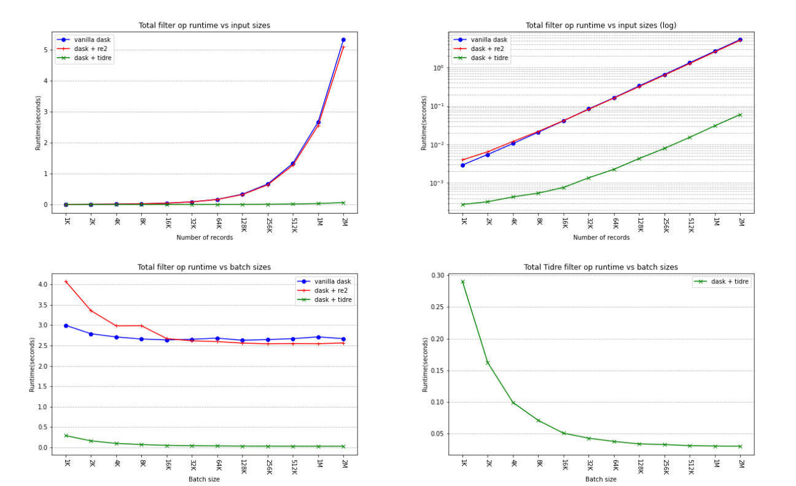

# AWS Demo
This README demonstrates how *dask accelerated* can be benchmarked on AWS F1. *Dask accelerated* is an implementation of
Tidre in the Dask framework. For instructions on how to run a standalone version of Tidre on AWS,
see [here](https://github.com/teratide/tidre-demo).

To run this demo, you just need an AWS account with the ability to launch F1
instances. You may need to request a quota limit increase from AWS to do so,
but this doesn't take long in our experience.

Step 1: launch the F1 instance
------------------------------

Go [here](https://console.aws.amazon.com/ec2/v2/home?region=us-east-1#LaunchInstanceWizard:)
to start the process. If the link is dead, just look for the "launch instance"
button on your EC2 dashboard. Keep in mind that not all regions have F1
instances!

In step 1 (AMI selection), look for AWS' CentOS-based FPGA Developer AMI on the
marketplace. We've tested this with version 1.9.1. In step 2 (instance type),
select `f1.2xlarge`. In step 4 (storage), you can get rid of the `/dev/sdb`
drive or select "delete on termination" if you like; we won't be using that
part of the image.

For the remaining steps, this guide assumes you're SSH'd into your F1 instance.

Step 2: download and install dependencies
-----------------------------------------

First of all, you'll need this repository. It uses submodules; make sure to do
a recursive clone.

```
git clone https://github.com/teratide/dask-accelerated.git --recursive
cd tidre-demo
```

*Dask accelerated* requires Python 3.8+ to run, but the FPGA Developer AMI comes
with Python 3.6. We will build 3.8 from source. At the same time we install `cmake3`,
which is required to build the binaries later.

```
    sudo yum -y update
    sudo yum -y groupinstall "Development Tools"
    sudo yum -y install openssl-devel bzip2-devel libffi-devel cmake3
    sudo yum -y install wget
    wget https://www.python.org/ftp/python/3.8.3/Python-3.8.3.tgz
    tar xvf Python-3.8.3.tgz
    cd Python-3.8*/
    ./configure --enable-optimizations
    sudo make altinstall
    cd ..
```

Step 3: Build binaries
----------------------

Fletcher on its own has no platform support; support for specific FPGA platforms needs to be installed separately.
The support library for AWS can be found at `native/fletcher-aws/runtime/runtime`. Before we can build that, however,
we'll need some environment setup from AWS.
```
    source native/fletcher-aws/aws-fpga/sdk_setup.sh
```

After that, just install normally.
```
    cd native/fletcher-aws/runtime/runtime
    mkdir -p build
    cd build
    cmake3 ..
    make -j
    sudo make install
    sudo ldconfig
    cd ../../../../..
```

In order to communicate with the FPGA, we'll also need the XDMA driver. It can be installed as follows.
```
    cd native/fletcher-aws/aws-fpga/sdk/linux_kernel_drivers/xdma
    make -j
    sudo make install
    cd ../../../../../..
```

Now the *dask accelerated* native binaries can be build, these also build Fletcher and RE2.
```
    mkdir -p native/build
    cd native/build
    cmake3 ..
    make
    cd ../..
```

Step 4: Configure FPGA
----------------------

Before the FPGA can be configured with the correct bitstream, it needs to be cleared.
```
    sudo fpga-clear-local-image -S 0
```

The bitstream that performs the target regular expression evaluation can now be loaded.
A different bitsream is required if another regular expression needs to be evaluated on the FPGA.
```
    # Regex evaluation for `teratide diving subsurface`
    sudo fpga-load-local-image -S 0 -I agfi-028fcd53df79020d9
```

From this point onward, loading another bistream does not require clearing the FPGA.

Step 5: Install python dependencies
-----------------------------------

A `setup.py` specifies the required modules, these can be installed using pip.

```
    sudo Python-3.8*/python -m pip install -e .
```

Step6: Benchmark the application
--------------------------------

Two benchmarks are provided. The first benchmarks the regex filter
runtimes under varying input sizes, while the second benchmarks these runtimes under varying batch sizes.

We run these benchmarks from the provided `benchmark/main.py`.
```
    cd benchmars
    sudo ../Python-3.8*/python main.py --tidre
```

Step 7: Download and plot results
---------------------------------
The results of these benchmarks automatically get written to a data file in `../notebooks/`. This data file can
be downloaded to the same folder on your local machine for further processing using `scp`. The commands below are meant te 
be run locally and NOT on AWS.

If you have not done so already, clone this repository to your local machine.
```
    git clone https://github.com/teratide/dask-accelerated.git --recursive
    cd dask-accelerated/notebooks
```

Next, we download the data file to this location.

```
    scp -i "PATH_TO_YOUR_KEY.pem" centos@YOUR_INSTANCE:/home/centos/dask-accelerated/notebooks/data.pickle ./data.pickle
```

This folder contains a jupyter notebook `plots.ipynb` that, when run,
generates all relevant plots and saves them in `../notebooks/plots`.

An example of such results can be seen below.



